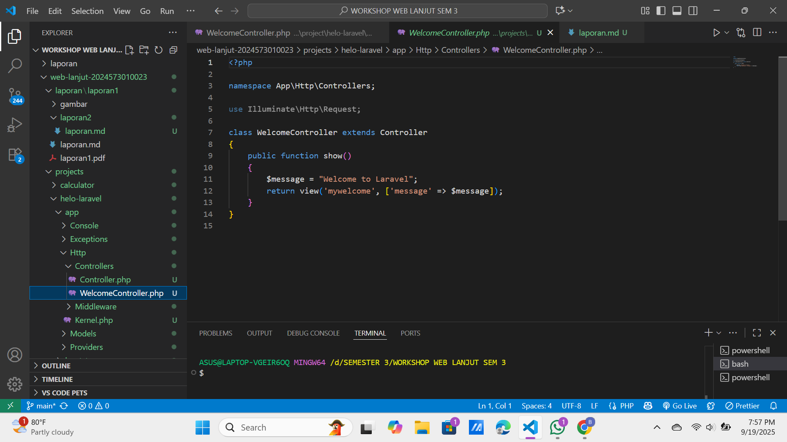
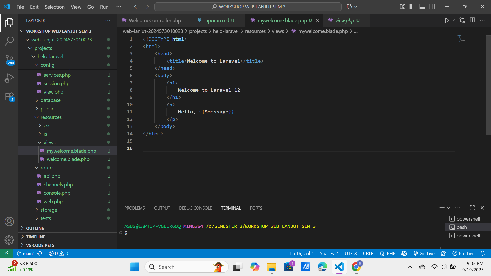
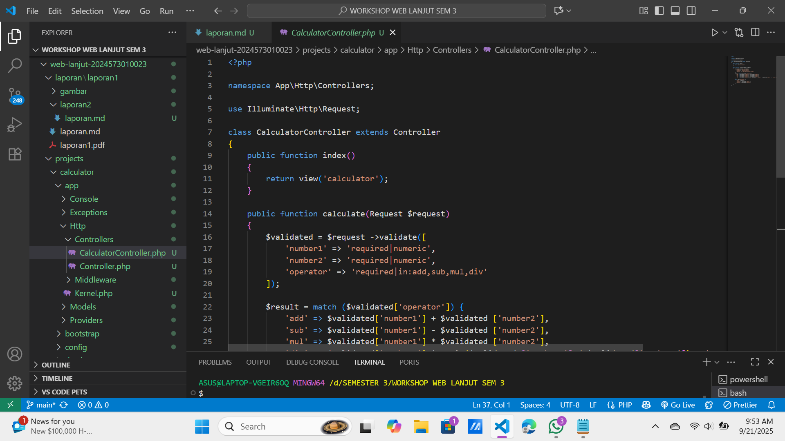
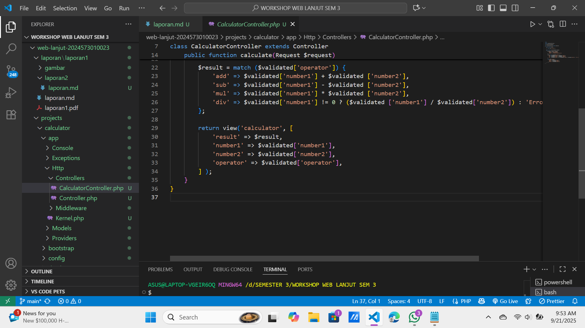
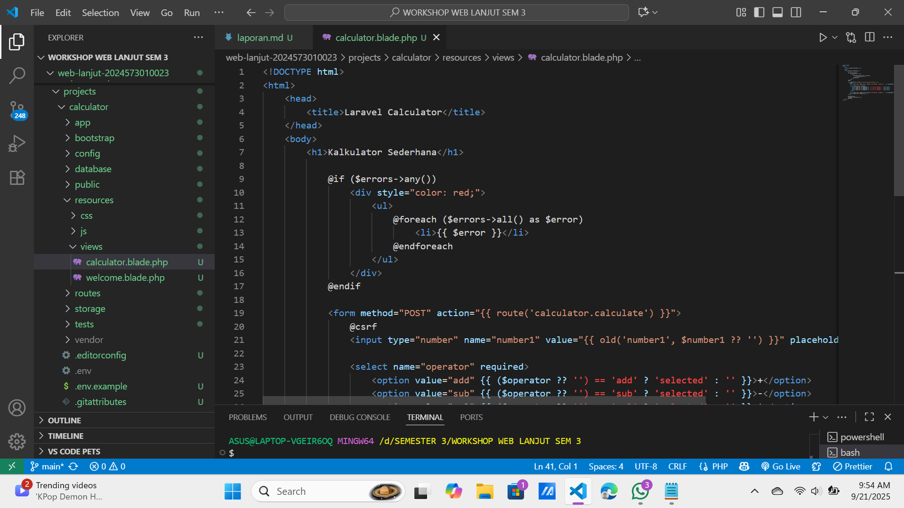

# Laporan Modul 2: Laravel Fundamentasl

**Mata Kuliah:** Workshop Web Lanjut  
**Nama:** Bunga Alfa Zahrah
**NIM:** 2024573010023
**Kelas:** TI-2C

---

## Abstrak

- Laporan ini membahas dasar-dasar penggunaan Laravel Framework khususnya pada konsep routing, controller, dan view yang merupakan bagian penting dari arsitektur MVC (Model-View-Controller). Praktikum dilakukan dengan dua studi kasus, yaitu pembuatan halaman sambutan sederhana (welcome page) dan pembuatan aplikasi kalkulator menggunakan Laravel. Tujuan dari laporan ini adalah untuk memahami cara kerja Laravel dalam menangani request dan response, bagaimana peran route, controller, dan view saling berhubungan, serta bagaimana memanfaatkan Blade Templating Engine untuk menampilkan data secara dinamis.  
- Dengan adanya praktikum ini, diharapkan mahasiswa mampu menguasai dasar pemrograman web menggunakan Laravel sebagai pondasi untuk mengembangkan aplikasi web yang lebih kompleks di masa mendatang.

---

## 1. Dasar Teori

- Apa itu MVC (Model, View, Controller). 

- Model View Controller atau yang dapat disingkat MVC adalah sebuah pola arsitektur dalam membuat sebuah aplikasi dengan cara memisahkan kode menjadi tiga bagian yang terdiri dari:

1. Model 
   Bagian yang bertugas untuk menyiapkan, mengatur, memanipulasi, dan mengorganisasikan data yang ada di database.

2. View 
   Bagian yang bertugas untuk menampilkan informasi dalam bentuk Graphical User Interface (GUI).

3. Controller 
   Bagian yang bertugas untuk menghubungkan serta mengatur model dan view agar dapat saling terhubung.

- Konsep Routing di Laravel. 
  Konsep Routing di Laravel adalah proses pemetaan alamat URL (seperti /tentang-kami) ke tindakan atau fungsi tertentu dalam aplikasi web Anda, menentukan kode mana yang akan dieksekusi untuk permintaan HTTP yang masuk.

- Fungsi Middleware. 
  Middleware menjadi salah satu fitur yang sangat penting pada Laravel. Dengan Middleware kita dapat mengontrol dan memodifikasi permintaan HTTP setelah ataupun sebelum permintaan tersebut diproses oleh aplikasi Laravel kita.
  Middleware adalah perangkat lunak yang berfungsi sebagai jembatan antara aplikasi, perangkat lunak, atau sistem yang berbeda dalam suatu arsitektur teknologi informasi.

- Bagaimana cara Laravel menangani Request dan Response. 
  Laravel menangani request dan response melalui siklus hidup request yang melibatkan kernel HTTP, middleware, dan objek Illuminate\Http\Request untuk menangkap data request dari klien. Untuk response, Laravel menyediakan berbagai cara, seperti mengembalikan string sederhana, objek Response, atau menggunakan fungsi response() untuk membuat respons kustom dengan status, header, dan cookie.

- Peran Controller dan View. 
  1.  Controller :
      Controller bertugas sebagai penghubung antara Model dan View. Controller mendapatkan input dari pengguna melalui HTTP Request, selanjutnya memproses input yang diterima tersebut dengan berinteraksi dengan Model. Terakhir mengembalikan hasilnya pada View untuk ditampilkan ke pengguna.

Controller berada di path directory “app/Http/Controllers”. Controller yang akan berperan pada logika aplikasi dengan berinteraksi dengan Model dan View.

Arsitektur MVC memisahkan antara logika, tampilan, serta kontroler sehingga membuat mudah dalam pemeliharaan dan pengembangan aplikasi secara menyeluruh.

2.  View :
    View bertugas sebagai tampilan website atau aplikasi. Data yang ditampilkan oleh view bisa berupa HTML, JSON, XML.

Letak path directory view ada di “resources/views”. Di Laravel pembuatan view menggunakan blade templating engine. File view ditulis dengan format namafile.blade.php.

- Fungsi Blade Templating Engine.  
  Fungsi utama Blade Templating Engine dalam Laravel adalah mempermudah pembuatan tampilan web yang dinamis, bersih, dan terstruktur dengan memisahkan logika tampilan dari konten HTML, memungkinkan penggunaan ulang kode melalui pewarisan template, serta menyediakan sintaks sederhana untuk menampilkan data dan struktur kontrol PHP.

---

## 2. Langkah-Langkah Praktikum

Tuliskan langkah-langkah yang sudah dilakukan, sertakan potongan kode dan screenshot hasil.

2.1 Praktikum 1 – Route, Controller, dan Blade View

- Tambahkan route pada routes/web.php.  
  Pertama, kita menambahkan route baru yang akan memanggil controller. Route ini berfungsi untuk menghubungkan URL dengan fungsi yang ada pada controller.
  

- Buat controller WelcomeController. 
  Selanjutnya, buat controller dengan perintah artisan di terminal : php artisan make: controller WelcomeController
  

- Buat view mywelcome.blade.php. 
  View digunakan untuk menampilkan tampilan ke pengguna. Buat file baru di folder resources/views/mywelcome.blade.php
  

- Jalankan aplikasi dan tunjukkan hasil di browser.  
  Jalankan server dengan perintah: php artisan serve

Screenshot Hasil:

2.2 Praktikum 2 – Membuat Aplikasi Sederhana "Calculator"

- Tambahkan route untuk kalkulator. 
  Buka file routes/web.php lalu tambahkan kode seperti di bawah ini:
  

- Buat controller CalculatorController. 
  Jalankan perintah artisan di terminal: php artisan make: controller CalculatorController
  Lalu buka file app/Http/Controllers/CalculatorController.php dan isi dengan:
  
  

- Tambahkan view calculator.blade.php.  
  Buat file di resources/views/calculator.blade.php:
  

- Jalankan aplikasi dan coba dengan beberapa input berbeda. 
  Jalankan server dengan perintah: php artisan serve

Screenshot Hasil:

---

## 3. Hasil dan Pembahasan

Jelaskan apa hasil dari praktikum yang dilakukan.

- Apakah aplikasi berjalan sesuai harapan?  
  Ya, aplikasi yang berjalan sesuai dengan harapan saya, karena Alhamdulillah berjalan dengan lancar.

- Apa yang terjadi jika ada input yang salah (misalnya pembagian dengan 0)?  
  Jika kita lakukan pembagian dengan 0 maka akan muncul tulisan "DivisionByZeroError", itu muncul karena di php hitung $number1/$number2 sementara ini $number2 nya bernilai 0 maka langsung error.

- Bagaimana validasi input bekerja di Laravel?  

  1. User kirim data melalui form (misalnya POST dari calculator.blade.php).  
  2. Data itu masuk ke Request object (Illuminate\Http\Request) dan diterima di Controller. 
  3. Laravel menyediakan method $request->validate([...]) untuk mengecek data sesuai aturan (rules). 
  4. Jika data valid, Laravel melanjutkan eksekusi ke kode berikutnya. 
  5. Jika data tidak valid, Laravel otomatis menghentikan proses, redirect balik ke halaman sebelumnya, dan mengirimkan error message. 
  6. Di View (Blade), error message bisa ditampilkan dengan $errors 
  7. Laravel punya banyak aturan validasi bawaan (required, numeric, email, min, max, in, dll) dan juga mendukung aturan kustom. 

- Apa peran masing-masing komponen (Route, Controller, View) dalam program yang dibuat? 
  1. Route  
     Route bertugas sebagai penghubung antara URL dengan logic di Controller.
     Jadi, saat user membuka /calculator, Laravel akan tahu harus menjalankan method tertentu di Controller.

Di program kalkulator:
Route::get('/calculator', [CalculatorController::class, 'index']);
Route::post('/calculator', [CalculatorController::class, 'calculate']);

GET /calculator → tampilkan form kalkulator.
POST /calculator → proses perhitungan.

2. Controller 
   Controller berfungsi sebagai otak (logic) aplikasi.
   Dia menerima request dari Route, memproses data (misalnya operasi matematika), lalu mengirim hasilnya ke View.

Di program kalkulator:
Method index() → menampilkan form awal.
Method calculate() → menerima input angka & operator, menghitung hasil, lalu mengirim ke view untuk ditampilkan.

3. View 
   View adalah tampilan (UI) untuk user.
   Di sini user bisa mengisi input angka, memilih operator, dan melihat hasil kalkulasi.

Di program kalkulator:
File calculator.blade.php berisi form HTML + kode Blade untuk menampilkan hasil perhitungan.

---

## 4. Kesimpulan

- Praktikum ini berhasil menunjukkan bagaimana Laravel bekerja berdasarkan konsep MVC (Model-View-Controller), di mana Route menghubungkan URL dengan Controller, Controller menjalankan logika aplikasi, dan View menampilkan hasil ke pengguna.

- Pada praktikum pertama, kami mempelajari cara membuat halaman sambutan sederhana (welcome page) dengan memanfaatkan route, controller, dan view.

- Pada praktikum kedua, kami membuat aplikasi kalkulator sederhana yang mampu melakukan operasi penjumlahan, pengurangan, perkalian, dan pembagian dengan memanfaatkan Blade Templating Engine untuk menampilkan data secara dinamis.

- Selama praktikum juga dipelajari validasi input di Laravel, yang berfungsi untuk memastikan data yang masuk sesuai aturan. Hal ini penting agar aplikasi aman, stabil, dan tidak mengalami error (misalnya pembagian dengan 0).

- Dengan adanya praktikum ini, kami mendapatkan pemahaman dasar tentang bagaimana Laravel menangani request dan response, serta bagaimana memanfaatkan komponen-komponen utamanya untuk membangun aplikasi web sederhana sebagai pondasi untuk pengembangan web yang lebih kompleks.

---

## 5. Referensi

1. fungsi middleware : https://www.codepolitan.com/blog/apa-itu-middleware-pengertian-contoh-dan-fungsinya/  
2. apa itu MVC : https://www.dicoding.com/blog/apa-itu-mvc-pahami-konsepnya/  
3. peran controller dan view : https://www.rumahweb.com/journal/belajar-laravel-bagian-3/  

---
