# Laporan Modul 3: Laravel Controller
**Mata Kuliah:** Workshop Web Lanjut   
**Nama:** Bunga Alfa Zahrah
**NIM:** 2024573010023 
**Kelas:** TI-2C  

---

## Abstrak 
- Laporan ini membahas penerapan Controller pada framework Laravel 12 sebagai bagian dari pola arsitektur Model-View-Controller (MVC). Tujuan dari praktikum ini adalah untuk memahami peran controller dalam mengelola logika aplikasi, menangani request dan response, serta menghubungkan antara route, model, dan view.
- Melalui tiga percobaan utama—menangani request dan response, membuat aplikasi sederhana menggunakan controller, serta mengelompokkan route dengan prefix dan namespace—praktikan mempelajari bagaimana struktur aplikasi Laravel dapat diorganisir secara efisien.
- Hasil dari praktikum menunjukkan bahwa penggunaan controller dalam Laravel mempermudah pengelolaan logika program, meningkatkan keteraturan kode, serta mendukung pengembangan aplikasi web yang terstruktur dan mudah dipelihara.

---

## 1. Dasar Teori
- Apa itu Controller
    - Dalam pola MVC (Model-View-Controller), sebuah controller bertindak sebagai jembatan antara model dan view. Controller menangani input pengguna, berinteraksi dengan model untuk data, dan mengembalikan respons yang benar, yang seringkali merender sebuah view.

- Jenis-Jenis Controller(Pada Laravel)
 Dalam laravel mendukung beberapa jenis controller untuk mendukung  berbagai perkembangan dalam web
    - 1.Basic Controllers(Controller dasar)
            Controller standar yang memiliki beberapa metode publik yang diantaranta(index, show, store, update, destroy)
    - 2.Resource Controller(Controller sumber daya)
             Controller yang dirancang untuk operasi CRUD pada sumber daya(resource) dengan metode-metode standar seperti index, create, store, show, edit, update, destroy
             Contoh pembuatan nya hampir sama dengan yg dasar cuman ada tambahan "--resource" di akhir
    - 3.Invokable Controller(Single-action Controller)
            digunakan ketika sebuah controller hanya melakukan satu tugas tunggal dan tidak perlu banyak metode.
            

 - Apa itu view,json,redirect,respon kostum dalam laravel
    - View digunakan untuk menampilkan tampilan(file.blade.php) ke pengguna biasanya dipakai untuk aplikasi web bwebasis antarmuka HTML
    - JSON response()->json() digunakan untuk mengirim data dalam format JSON, biasanya untuk API atau AJAX request
    - redirect() digunakan untuk mengalihkan (memindahkan) pengguna ke route atau URL lain.
    

---

## 2. Langkah-Langkah Praktikum
Tuliskan langkah-langkah yang sudah dilakukan, sertakan potongan kode dan screenshot hasil.

2.1 Praktikum 1 – Menangani Request dan Response View di Laravel 12

- Tambahkan route pada routes/web.php.
    Editkan di routes/web.php menjadi seperti pada gambar berikut.
    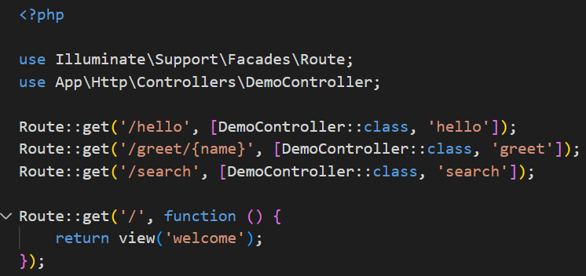 dan itu mengarah ke Demo controller , kemudian buat controller nya(DemoController).

- Buat controller DemoController.php
    Create DemoController pada GitBash yang ada pada vscode lalu ketikkan sesuai dengan gambar berikut
    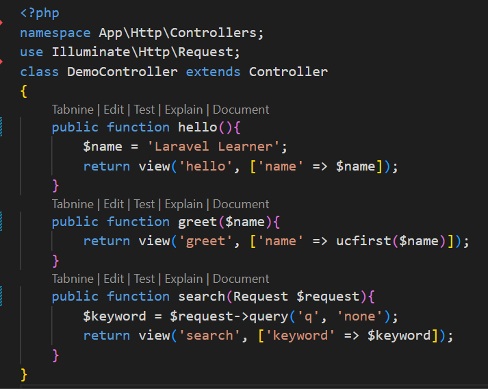

- Buat view sederhana pada resources/views.
   buat file blade ini pada resources/views:
        - hello.blade.php
            Buatlah code nya seperti berikut: 
    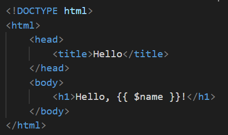
        - greet.blade.php
            Buatlah code nya seperti berikut:
    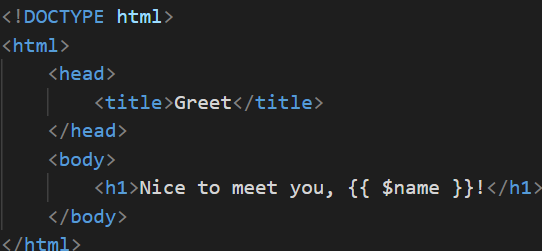
        - search.blade.php
            Buatlah code nya seperti berikut:
    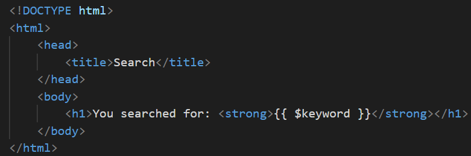

- Jalankan aplikasi dan tunjukkan hasil di browser.
    http://127.0.0.1:8000/hello
      Tampilan Browser 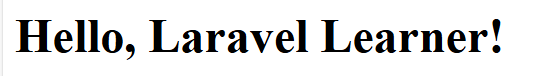
    http://127.0.0.1:8000/greet/Bunga (Pada url ini bebas tergantung codingannya yang anda inputkan.)
      Tampilan Browser 
    http://127.0.0.1:8000/search?q=laravel
      Tampilan Browser 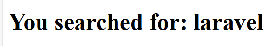

2.2 Praktikum 2 – Membuat Aplikasi Sederhana "Calculator"

- Tambahkan route PageController dalam web.php.
    Editkan di routes/web.php menjadi seperti pada gambar berikut.
    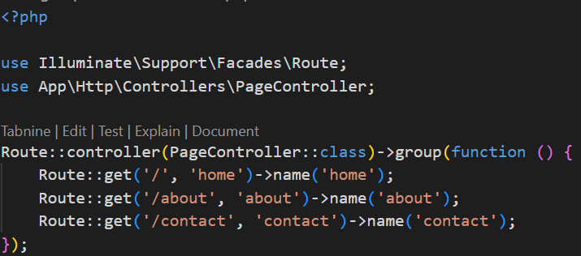
    
- Buat controller PageController.
    Buat PageController pada Gitbash, yg tersimpan pada folder "app/http/controller", 
    lalu buat code nya seperti ini 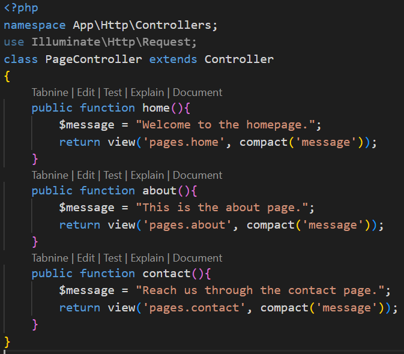

- Tambahkan view home.blade.php, about.blade, contact blade.php
    buat file blade ini pada resources/views, lalu buat folder baru dalam views pages menjadi resources/views/pages

        - about.blade.php
            Buatlah code nya seperti berikut: 
    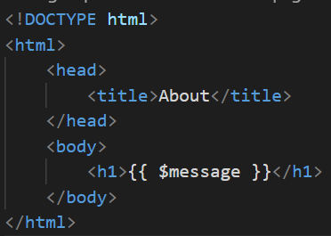
        - contact.blade.php
            Buatlah code nya seperti berikut:
    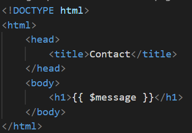
        - home.blade.php
            Buatlah code nya seperti berikut:
    

- Jalankan aplikasi dan coba dengan beberapa input berbeda.
    http://127.0.0.1:8000/   home
      Tampilan Browser : 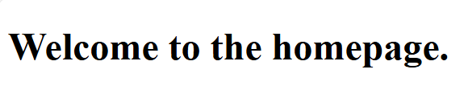
    http://127.0.0.1:8000/about
      Tampilan Browser : 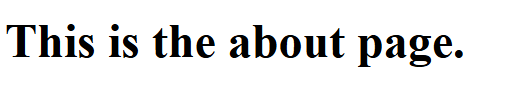
    http://127.0.0.1:8000/contact
      Tampilan Browser : 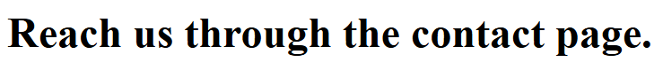

---

2.3 Praktikum 3 – Pengelompokan Prefix dengan namespace Rute di Laravel 12

- Tambahkan route untuk prefix dan namespace Controller
    Editkan di routes/web.php menjadi seperti ini. 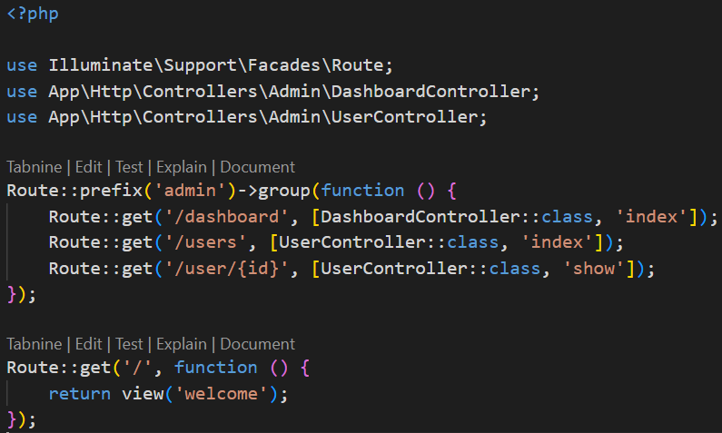

- Buat controller DashboardController dan user.
    ini akan membuat dua controller di direktori app/Http/Controllers/Admin

- Tambahkan aksi ke controller
    membuat dashboardcontroller dan usercontroller
    - 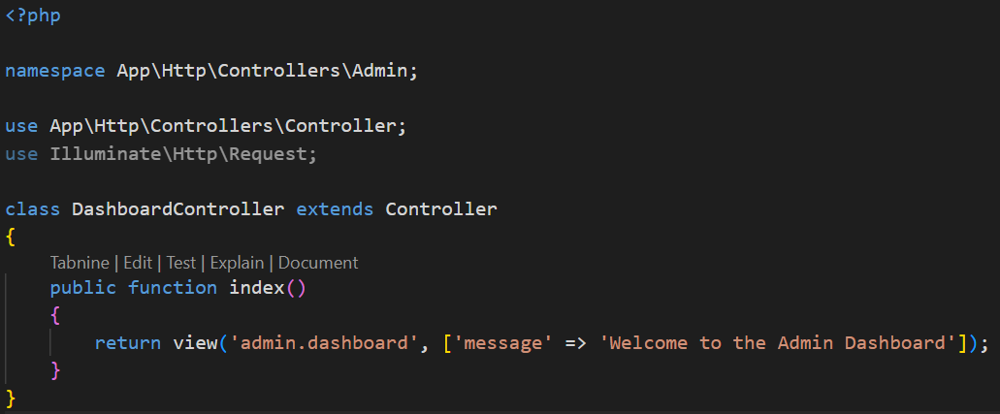
    - 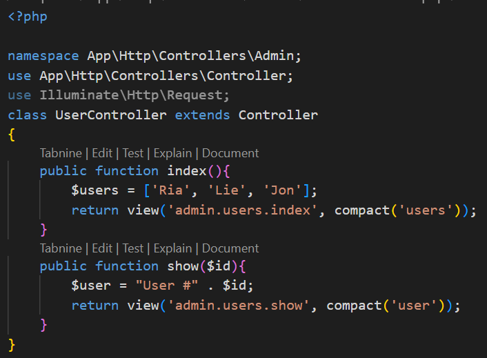
- Buat view sederhana 
     buatkan di folder resources/views/admin/user
     dan ada 3 file
     1. index
        editkan code nya seperti ini : 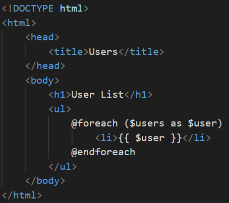
     2. show
        editkan code nya seperti ini : 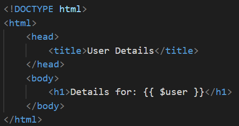
     3. dashboard
        editkan code nya seperti ini : 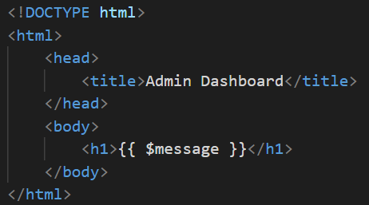

- Jalankan aplikasi 
    http://127.0.0.1:8000/admin/dashboard
    Output: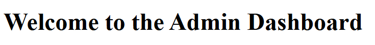
    http://127.0.0.1:8000/admin/users
     Output: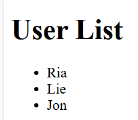
    http://127.0.0.1:8000/admin/users/2
      Output:!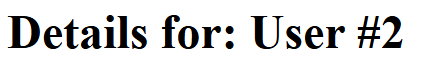
    

---

## 3. Hasil dan Pembahasan
Jelaskan apa hasil dari praktikum yang dilakukan.
- Apakah aplikasi berjalan sesuai harapan?
    Pada praktikum ini, ketiga praktikum  aplikasi nya berjalan sesuai harapan saya, tidak ada kendala
- Apa peran masing-masing komponen (Route, Controller, View) dalam program yang dibuat?
    Peran route:
    Menentukan arah alur permintaan (request) ke bagian aplikasi yang sesuai — biasanya ke Controller.
    Peran Controller:
        Mengatur logika aplikasi — menjadi penghubung antara Route (input dari user) dan View (tampilan ke user).
    Peran View:
    Menampilkan hasil akhir ke pengguna (biasanya dalam bentuk HTML).
    

---

## 4. Kesimpulan

- Dalam bab ini, kita telah membahas dasar-dasar controller di Laravel 12, termasuk cara membuatnya, mendefinisikan rute, dan meneruskan data ke view. Kita juga mengeksplorasi berbagai jenis controller, seperti resource controller dan invokable controller, serta mempelajari cara mengelompokkan rute untuk organisasi yang lebih baik.

- Kita juga membahas cara menangani permintaan, memvalidasi input, dan mengembalikan berbagai jenis respons. Terakhir, kita menyelesaikan lab praktik untuk memperkuat konsep-konsep ini dengan membuat aplikasi web sederhana yang mendemonstrasikan penanganan permintaan dan pengelompokan rute.

---

## 5. Referensi
- https://laravel.com/docs/12.x/controllers
- https://santrikoding.com/tutorial-laravel-12-2-cara-install-laravel-12
- https://dev.to/robin-ivi/laravel-12-a-beginner-friendly-guide-3of
- https://hmsifmipauntan.com/laravel-12-evolusi-framework-php-untuk-pengembangan-aplikasi-modern

---
